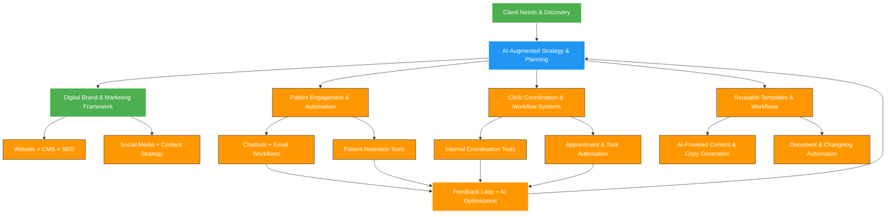

---

# 🦷 Main Hub – Consulting Collaboration Portal

**Supreme Dental Clinics × King Ting (IT & Operations Consultant)**

Welcome to the **Main Hub** for our strategic engagement with **Supreme Dental Clinics**.

This portal serves as the **single source of truth** for documents, plans, tools, and progress updates throughout our collaboration. It brings together discovery findings, actionable frameworks, and implementation roadmaps — designed to support business, operational, and technical stakeholders alike.

---

## 🚀 Our Collaborative Approach

We work with your clinic group through a **phased, AI-supported transformation journey**, combining:

* 🎯 **Strategic Planning** – Discovery-driven frameworks that guide branding, operations, and marketing  
* 🔧 **Systems & Automation** – Practical tools and workflows to reduce friction and boost consistency  
* 🤖 **AI-Enabled Support** – Content generation, SEO, and communications workflows powered by intelligent tools  
* 📈 **Data & Governance** – Measurable KPIs, scalable templates, and iterative planning based on results  

Together, we are shaping a **unified, scalable, and future-ready dental organisation** — not through one-off deliverables, but through **intelligent, evolving systems** that grow with your business.

---

## 🧠 Consulting Approach: System-Driven & AI-Augmented

Unlike traditional consulting, our methodology is built around **technology integration**, **process systematisation**, and **AI-powered execution**. The diagram below shows how we embed intelligence into every phase of the transformation:

This architecture enables Supreme Dental Clinics to move from **manual, reactive operations** to a **proactive, intelligent, and scalable system** — where strategy, execution, and feedback are tightly aligned and continuously evolving.

---

## 📄 What’s Inside

* 📘 Discovery report, strategic plans, and visual frameworks  
* 🧠 AI-enriched documentation (SEO, content, automation workflows)  
* 🧩 Implementation blueprints and integration plans  
* 📂 Ongoing reports and knowledge assets for decision-making  

> This repository evolves with your journey. Everything is versioned, traceable, and designed for long-term reuse.

---

## 🌐 View the Documentation Online

Browse the full documentation set and updates on our easy-to-navigate site:

🔗 **[View Consulting Documentation Site](https://supremedental.ocooee.com/)**

---

## 🤝 How to Use This Repository

* 🔍 **Read the `docs/` folder** for reports, frameworks, and checklists  
* 🌐 **Use the documentation site** for easy browsing and discussion  
* 💬 **Collaborate transparently** via feedback, comments, or requests for enhancements  

We welcome your ideas and input at every step — this is a **shared design process**, not a static report.

---

## 🔎 Featured Insight

> *“By aligning strategic goals with scalable systems and introducing lightweight AI tools into everyday processes, we reduce complexity while accelerating growth and trust.”*

---

## 🛠️ What We’re Building Together

* A **unified digital brand**: professional, consistent, scalable  
* A **high-performing website** with strong SEO and integrated analytics  
* A **repeatable content system**: blogs, social posts, newsletters  
* A **patient engagement engine**: automated follow-ups, loyalty programs  
* A **governed knowledge base** for clinic operations and training  

These assets are designed for **reuse, automation, and AI augmentation** as we move into future phases.

---

## ✅ Let’s Stay Connected

Have a question, request, or idea?  
Reach out any time — our collaboration is active, adaptive, and built for long-term success.

---

> 🛠️ *This repository is not just a record of transformation — it is the transformation engine.*

---