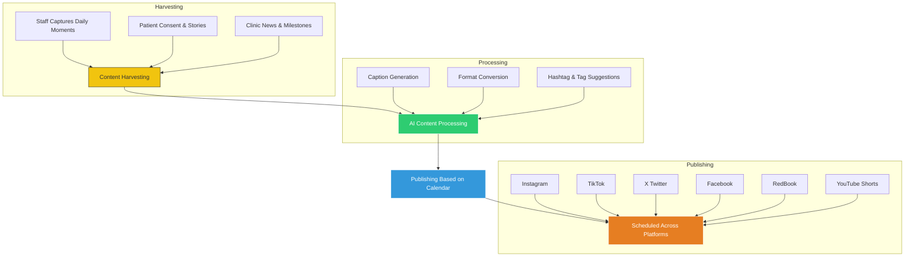

# 3.3 Social Media Strategy

## 🎯 Objective  
To transform social media into a **planned, strategic marketing channel** by building a **calendar-driven content strategy** that aligns with key **dental, medical, educational, and local community events in Australia**.

This approach will ensure that every post has purpose, relevance, and impact — while leveraging AI-powered tools to automate publishing and maximize reach.

---

## 🔍 The Challenge  
Currently, social media efforts are inconsistent and uncoordinated. Posts are published sporadically with no clear brand voice or engagement strategy. This results in:

- Missed opportunities to showcase real patient outcomes  
- Inconsistent messaging across locations  
- Underutilized potential for organic growth  
- Heavy reliance on paid advertising without measurable ROI  

In dentistry, every day brings new moments of transformation, education, and community connection — yet these moments often go unnoticed online.

---

## 💡 Why This Matters  
Dental practices have something most brands can only dream of — **real-world impact**. Each consultation, treatment, and patient journey offers authentic storytelling potential that builds trust and drives engagement.

But to unlock that potential, we need more than just content — we need **strategy**.

A **calendar-driven social media plan** ensures that:
- Content is timely, relevant, and aligned with national and local events  
- Campaigns are launched at optimal times to capture attention  
- Patient education and promotions are delivered when they matter most  
- Every post contributes to long-term brand authority and visibility  

Social media isn’t just about being seen — it’s about being **seen at the right time, saying the right thing**.

---

## 📅 Strategic Content Calendar: Timing Is Everything

We will build a **12-month content calendar** structured around four key pillars:

| Pillar | Description |
|--------|-------------|
| **Dental & Medical Events** | Align with major Australian health awareness days (e.g., Oral Health Month, World Oral Cancer Day) |
| **School Terms & Seasons** | Back-to-school checkups, summer smile prep, winter dental care tips |
| **Clinic Milestones** | Staff birthdays, clinic anniversaries, patient success stories |
| **Local Community Events** | Local festivals, charity events, school partnerships |

### Example Monthly Highlights

| Month | Dental Focus | Seasonal Event | Awareness Day |
|-------|--------------|----------------|---------------|
| February | Back-to-School Smile Check | Start of School Term 1 | Children's Dental Health Month |
| May | Gum Disease Awareness | Winter Preparation | World Oral Cancer Day |
| August | Teeth Whitening Special | Mid-Year Promotion | National Health Week |
| November | Holiday Smile Prep | End-of-Year Promotions | Oral Cancer Awareness Month |

This structure ensures your clinics remain **top of mind** throughout the year, not just during random posting windows.

---

## 🧠 Intelligent Content Flow: From Clinic to Platform

Here’s how we’ll turn everyday interactions into a powerful digital presence:

---

## 🌟 Strategic Approach

We propose a structured, scalable approach to social media that turns your entire clinic network into a **content generation machine**, driven by a **strategic calendar** and powered by **intelligent automation**.

### 🔑 Content Is the Core of Social Media Success  
Your clinics generate valuable content daily — from patient transformations to expert Q&As. Once a content creation system is in place, the **limit to how much content you can publish is practically unlimited**.

But content alone isn’t enough — you need **intelligent systems** to:
- Repurpose content across formats (video, carousels, blog posts)  
- Tailor captions and visuals for different platforms  
- Schedule and publish consistently without manual effort  

> Think of each platform — Instagram, TikTok, X (Twitter), Facebook, RedBook, YouTube Shorts — not as separate strategies, but as **broadcast channels** for your unified message.

---

## 🧩 Key Benefits of Our Approach

| Benefit | Explanation |
|--------|-------------|
| **Builds Trust & Loyalty** | Authentic, consistent content fosters stronger patient relationships |
| **Generates Leads Organically** | High-quality content attracts new patients without heavy ad spend |
| **Positions Clinics as Experts** | Educational and behind-the-scenes content establishes authority |
| **Scales with Growth** | As new clinics open, they contribute to the same content engine |
| **Reduces Marketing Spend** | Less reliance on paid ads when organic reach increases |
| **Improves SEO & Visibility** | Social signals help boost website rankings and brand awareness |
| **Maximizes Seasonal Opportunities** | Campaigns timed to school terms, holidays, and health awareness events |

---

## 📈 Our Proposed Phases

Here’s a high-level overview of how we’ll implement this strategy over time:

### Phase 1: Foundation Building – Month 1–2
- Audit existing social media presence  
- Define unified brand voice and visual identity  
- Identify key content themes and calendar structure  
- Train internal teams on content capture and submission  

### Phase 2: Content Engine Development – Month 3–4
- Launch a coordinated content creation system  
- Begin harvesting content from daily operations  
- Build a content repository for reuse and repurposing  
- Pilot short-form video content and staff-led posts  

### Phase 3: Intelligent Publishing System – Month 5–6
- Set up AI-powered tools for caption writing, formatting, and scheduling  
- Automate cross-platform publishing to major social networks  
- Implement analytics tracking to measure performance  
- Refine content mix based on engagement data  

### Phase 4: Multi-Clinic Amplification – Month 7+
- Roll out the strategy across all clinics  
- Encourage staff-driven contributions at scale  
- Run targeted campaigns aligned with local events and promotions  
- Continuously refine and optimize based on performance insights  

---

## 🚀 Milestone: Coordinated Campaign by September 2025  
We recommend launching a **multi-clinic pilot campaign by September 2025**, featuring:
- A unified theme (e.g., “Healthy Smiles, Happy Families”)  
- Cross-location content sharing  
- Patient story highlights  
- Staff-led educational segments  

This will serve as a blueprint for future campaigns and demonstrate the **ROI of a centralized strategy**.

---

## 💬 Final Thought for Your Client

> “Your clinics don’t just provide dental services — they’re living, breathing sources of authentic content. With the right system in place, every appointment becomes a story, every patient interaction becomes a post, and every staff member becomes a brand ambassador.  
>  
> By building a **smart, scalable content engine**, we’ll turn your network into a powerful digital presence that reaches more patients, builds deeper trust, and delivers measurable business growth — all while spending less on ads.”

---
