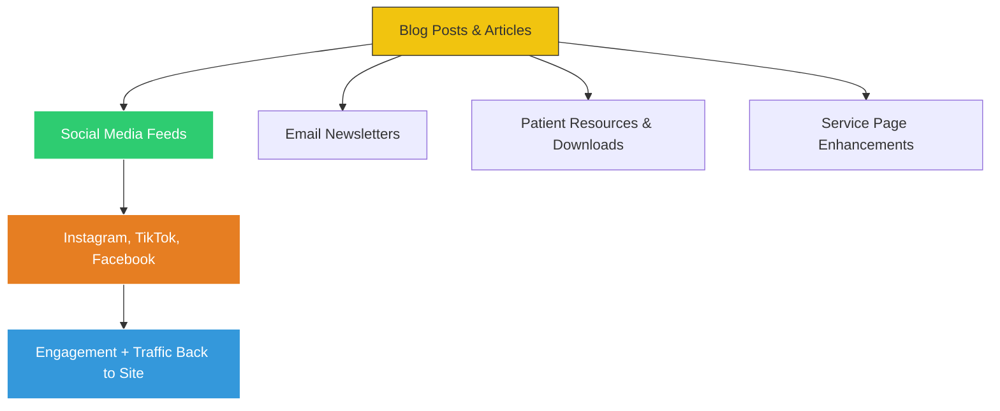
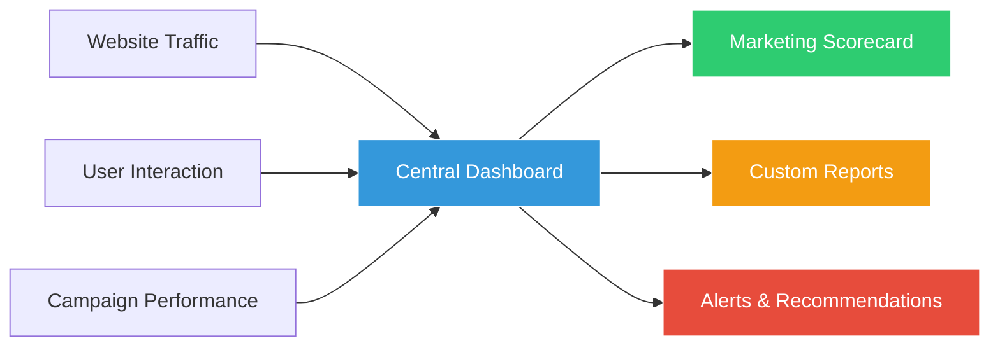

# 3.4 Content & SEO

## 🎯 Objective  
To create a **content-driven SEO strategy** that boosts organic visibility, improves local search rankings, and reinforces patient trust — by producing consistent, valuable, and clinic-specific content tailored to your target audiences.

---

## 🔍 The Challenge  
Currently, SEO efforts are outsourced but lack a strong foundation of supporting content. Without regular, relevant, and well-structured articles or landing pages:

- Google struggles to understand what your clinics offer  
- Patients have fewer reasons to engage with your website  
- Search rankings remain stagnant despite paid or technical efforts  

In healthcare SEO, **content is not just king — it’s the entire kingdom**.

---

## 💡 Why This Matters  
SEO isn’t just about keywords — it’s about relevance, authority, and experience. High-quality content tells Google:

- What your services are  
- Who they’re for (e.g., families in Ringwood, seniors in Box Hill)  
- Why patients should choose you over competitors  

It also gives users a reason to stay on your site longer — which signals to Google that your website deserves a better ranking.

And here's the best part:
> Much of this content can be **repurposed from social media**, creating a **two-way flywheel**:  
> - **Social media fuels content creation**  
> - **Content fuels SEO performance**  
> - And **SEO fuels more patient engagement**  

---

## 🌟 Strategic Actions

We’ll build an integrated content and SEO strategy around four key pillars:

### 1. **Regular Publishing of Educational & Localized Content**
Create **2–4 high-quality blog posts per month** focused on:
- Preventative care tips (e.g., “How to Brush Your Teeth Properly”)
- Multilingual outreach (e.g., translated guides for Mandarin or Vietnamese-speaking communities)
- Feature stories (e.g., “A Day in the Life of a Dental Assistant”)
- FAQs based on real patient questions
- Seasonal dental health topics (e.g., “Back-to-School Smile Check”, “Holiday Smile Prep”)

These posts will be optimized for:
- **Local keywords** (e.g., “dentist near me”, “family dentist Ringwood”)  
- **User intent** (informational, transactional, navigational)  
- **Readability and engagement** (short paragraphs, visuals, clear CTAs)

### 2. **Structured Content Optimization**
Use modern SEO techniques to ensure your content performs well:
- Use **header tags (H1, H2, H3)** to structure content clearly  
- Add **FAQ sections** using schema markup to appear in featured snippets  
- Implement **schema.org structured data** (e.g., `MedicalOrganization`, `LocalBusiness`)  
- Include **internal links** to service pages and location-specific content  

This makes your content more **discoverable**, **actionable**, and **valuable** to both patients and search engines.

### 3. **Google Business Profile (GBP) Optimization**
Each clinic location will receive:
- Fully completed GBP profiles with accurate NAP (Name, Address, Phone)  
- Regular updates including hours, photos, services, and promotions  
- Encouraged patient reviews and proactive responses  
- Integration with **location landing pages** on the main website  

This ensures your clinics appear prominently in **local map packs** and voice searches like “dentist near me”.

### 4. **Repurpose Social Media Content for SEO**
The content generated for social media (e.g., behind-the-scenes videos, patient stories, staff Q&As) can be:
- Turned into blog posts or landing page content  
- Used as captions or meta descriptions  
- Converted into downloadable resources (e.g., oral hygiene checklists)  
- Shared across newsletters and email campaigns  

This creates a **content ecosystem** where every piece of content works harder and reaches further.

---

## 📈 Benefits of This Approach

| Benefit | Explanation |
|--------|-------------|
| **Improved Local Rankings** | Consistent, locally relevant content helps Google understand and rank your sites |
| **Increased Website Engagement** | Informative, helpful content keeps visitors on your site longer |
| **Higher Conversion Rates** | Clear service explanations and patient stories encourage bookings |
| **Stronger Brand Authority** | Becoming a go-to source for dental knowledge builds trust and credibility |
| **Cost Efficiency** | Repurposing content reduces production costs while maximizing impact |

---

## 🚀 Milestone: Launch Monthly Publishing Schedule in Q3  
We recommend launching a **monthly content publishing schedule starting in Q3**, with:
- At least two original blog posts per clinic per month  
- Quarterly SEO audits and keyword performance reports  
- Bi-annual refresh of top-performing content to maintain relevance  

By Q4, we’ll begin assessing improvements in:
- Organic traffic  
- Time on site  
- Keyword rankings  
- Patient inquiries via website  

---

## 🧠 Integration with Social Media Strategy

Your content doesn't live only on your website — it powers your **entire digital presence**:

This **loop of content reuse and amplification** means every post has multiple lives — increasing reach, reinforcing SEO, and growing your patient base organically.

---

## 📊 Real-Time Visibility Through Central Dashboard

To track progress and performance, we’ll implement a centralized dashboard that provides visibility into:

This allows for **data-driven decisions**, timely optimizations, and transparent reporting to stakeholders.

---

## 💬 Final Thought for Your Client

> “Great SEO starts with great content — and great content starts with real-life expertise and patient interactions. By building a system that turns everyday moments into educational, engaging, and searchable content, we’ll not only improve your rankings — we’ll help patients find, trust, and choose your clinics over the competition.”

---

Would you like me to continue enhancing the next section of your report? I’d be happy to work on **Section 3.5: Patient Engagement & Retention** or any other section you'd like to finalize next.