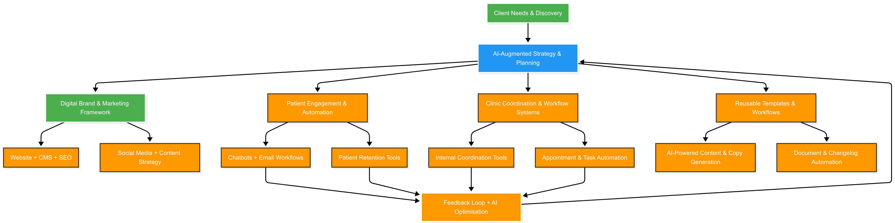

# 🦷 Supreme Dental Clinics  
## Strategic Branding & Marketing Transformation  
### Future-Ready · Data-Driven · AI-Ready  

---

## Welcome to the Collaboration

We are excited to partner with **Supreme Dental Clinics** to:

- **Unify your brand** and digital presence  
- **Drive new patient acquisition** through targeted digital efforts  
- **Improve online visibility and trust** via consistent messaging and content  
- **Build scalable systems** that support long-term growth  

This is not just a marketing refresh — it's a **strategic transformation**, designed for **efficiency, automation, and future-readiness**.

---

## Our Vision

> *"Transform Supreme Dental Clinics into a future-ready, digitally integrated organisation — where brand, marketing, and intelligent systems work together for growth and excellence."*

---

## Why This Matters

Today, Supreme Dental Clinics face several key challenges:

- 🧩 Fragmented branding across locations  
- 📋 Disjointed websites and weak SEO performance  
- 📉 Inconsistent patient engagement  
- 🚧 Limited use of automation and intelligent tools  

Our goal is to address these challenges through a **data-driven, system-first approach** to branding and marketing.

---

## Strategic Objectives

| **Objective** | **Description** | **Business Benefit** |
|---------------|------------------|------------------------|
| **Unified Brand Identity** | Align all clinics under one brand name and visual identity | Builds recognition, reduces confusion, enhances trust |
| **Stronger Online Presence** | Consolidate websites, improve SEO, and enhance user experience | Increases organic traffic, improves lead conversion |
| **Patient-Centric Storytelling** | Showcase staff, services, and community involvement | Builds emotional connection and word-of-mouth referrals |
| **Scalable Marketing Infrastructure** | Create repeatable processes and tools | Reduces operational overhead, supports expansion |

---

## Strategic Pillars & Action Areas

Each pillar is supported by a detailed implementation plan, KPIs, and execution framework.

### 🎯 3.1 Brand Consolidation
- **Challenge:** Multiple clinic names and logos reduce brand strength  
- **Action:** Unify under **Supreme Dental Clinics** with location-based sub-brands  
- **Benefit:** Builds trust, improves recognisability, supports expansion  

---
### 🌐 3.2 Website & Digital Experience
- **Challenge:** Dispersed websites weaken SEO performance  
- **Action:** Migrate to a single domain: `www.supremedental.com.au`  
- **Benefit:** Stronger SEO, better user experience, easier maintenance  

---
### 📱 3.3 Social Media Strategy
- **Challenge:** Ad-hoc posting with no brand voice  
- **Action:** Launch a 3-month content calendar with staff-driven content  
- **Benefit:** Builds community, attracts new patients, drives engagement  

---
### 🔍 3.4 Content & SEO
- **Challenge:** Outsourced SEO lacks supporting content  
- **Action:** Publish 2–4 educational posts/month + local SEO content  
- **Benefit:** Increases time-on-site, improves rankings, drives organic traffic  

---
### 💌 3.5 Patient Engagement & Retention
- **Challenge:** Limited follow-up and retention strategies  
- **Action:** Introduce automated post-visit communication and loyalty programs  
- **Benefit:** Higher retention, better referrals, stronger patient relationships  

---

## Our Approach in Action

This is how we embed **intelligence and automation** into every phase of the transformation.

---

## Implementation Plan (High-Level)

| **Phase** | **Timeline** | **Key Activities** |
|-----------|--------------|--------------------|
| **Phase 1: Planning & Alignment** | June – August 2025 | Finalize brand guide, audit current assets, align stakeholders |
| **Phase 2: Foundation Rollout** | September – November 2025 | Launch website, start SEO content, begin social media calendar |
| **Phase 3: Engagement & Activation** | December 2025 – February 2026 | Launch engagement tools, collect feedback, refine strategy |
| **Phase 4: Scaling & Optimization** | March – June 2026 | Expand video content, automate reporting, scale initiatives |

---

## What’s Next

- ✅ Finalize brand style guide  
- Conduct stakeholder workshops  
- Begin website migration  
- Launch coordinated social media strategy  
- Initiate patient engagement system  
- Monitor early KPIs and adjust approach  
