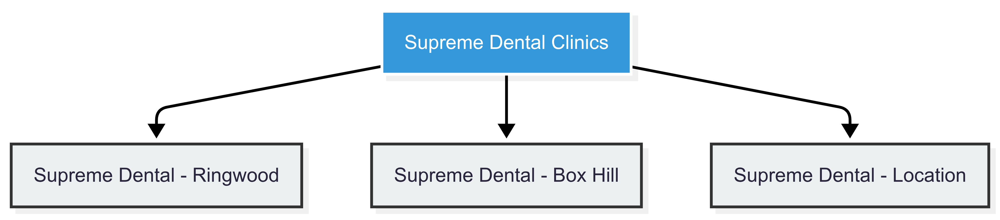

# 🦷 3.1 Brand Consolidation  
## Building a Unified Identity for Growth and Trust  

---

## 🔍 The Challenge

Currently, your clinics operate under varying names, logos, and visual identities.

While each may have local appeal, this fragmentation:

- Dilutes your overall brand strength  
- Confuses patients about which clinics are part of the same provider  
- Weakens marketing efforts and brand recognition  

In healthcare — especially dentistry — **trust, familiarity, and consistency** are key decision drivers.

A disjointed brand weakens these critical elements.

---

## 🧭 Why This Matters: The Strategic Impact

A **unified brand architecture** isn’t just about looking professional — it’s about creating a **single, powerful identity** that patients instantly recognize and trust.

When done right, this approach:

- ✅ Builds patient loyalty through repeated, familiar exposure  
- ✅ Strengthens referral power — people refer what they remember  
- ✅ Improves SEO and digital performance  
- ✅ Accelerates scalability — new clinics launch faster  
- ✅ Enhances perceived quality — a cohesive brand signals excellence  

---

## 🌐 Brand Architecture Model

Think of brands like **Mayo Clinic**, **Cleveland Clinic**, or even **Starbucks** — all use a **master-sub brand model** to grow nationally (or globally) while maintaining strong recognition and trust.

---

## 🛠️ Our Strategic Approach: Master Brand + Sub-Brands

We propose a clear, scalable structure:

### **Master Brand:** *Supreme Dental Clinics*  
– Central hub of your identity  
– Used in corporate communications, advertising, and brand-building initiatives  

### **Sub-Brands:** *Supreme Dental – [Location]*  
– For individual clinics, e.g., *Supreme Dental – Ringwood*, *Supreme Dental – Box Hill*  
– Maintains local relevance while reinforcing the main brand  

This ensures every touchpoint contributes to a **single, growing brand equity**, rather than scattering it across multiple identities.

---

## 📊 Brand Architecture Overview

Here’s a visual representation of how the brand hierarchy will be structured:

---

## 🎨 Key Deliverables: What We’ll Create Together

### 1. **Master Brand Logo**
- Clean, modern, emotionally resonant design  
- Works across all mediums: digital, print, signage, uniforms  
- May involve redesigning the current logo for clarity and flexibility  

### 2. **Sub-Brand Logos**
- Localized variations of the master logo  
- Retain core branding while incorporating subtle identifiers  
- Ensures **local connection** without sacrificing brand unity  

### 3. **Comprehensive Visual Identity System**
- Color palette: calming, professional, and memorable  
- Typography: modern fonts that enhance readability and trust  
- Imagery style guide: photography guidelines  
- Iconography: custom-designed icons aligned with your brand tone  
- Tone of voice: professional yet approachable  

### 4. **Brand Style Guide**
- A detailed manual outlining how to apply the brand consistently  
- Includes logo usage rules, spacing requirements, dos and don’ts  
- Becomes the go-to reference for internal teams and future partners  

### 5. **Implementation Across All Touchpoints**
- Website: unified look and feel across all clinic pages  
- Signage: branded exterior and interior signs  
- Social Media: templates, profile images, post styles  
- Email Templates: branded newsletters and reminders  
- Patient Materials: brochures, appointment cards, posters  
- Staff Uniforms: branded apparel that reinforces professionalism  

---

## 📅 Implementation Timeline

| Phase | Duration | Key Activities |
|-------|----------|----------------|
| Discovery & Research | Month 1–2 | Stakeholder interviews, competitor audit, brand workshops |
| Logo & Identity Design | Month 2–4 | Master logo development, sub-brand concepts |
| Visual System Build | Month 4–6 | Color, typography, imagery, iconography |
| Brand Style Guide Finalization | Month 6–7 | Documentation, internal training materials |
| Rollout Across Touchpoints | Month 7–12 | Website, signage, email, social, printed materials |

---

## ✅ Outcomes You’ll Achieve

By the end of this engagement, you’ll have:

- A **strong, recognizable brand** that patients trust and remember  
- A **scalable identity system** that supports future growth  
- A **professional, consistent image** across all locations  
- A **centralized brand guide** that makes managing your identity easier  
- Increased **referral potential** and **patient retention** due to stronger recognition  

---

## 💬 Final Thought

> “You already offer excellent care — but great service alone doesn’t build a brand. Recognition does. Loyalty does. Consistency does. With a unified brand strategy, we’ll help your patients see one thing clearly:  
>  
> **You’re not just a collection of clinics — you’re the trusted dental provider in their community.**”

---