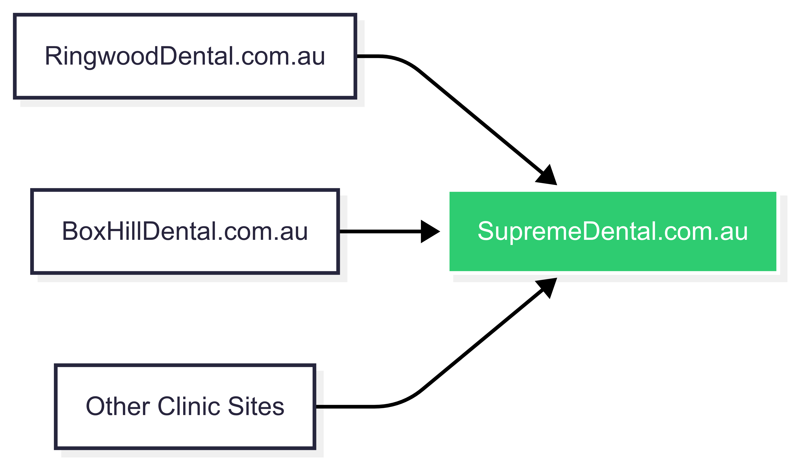
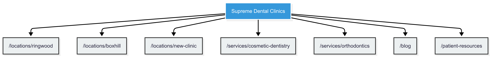

---

# 🦷 3.2 Website & Digital Experience  
## Unified Digital Presence for Growth & Scalability  

---

## 🎯 Objective

To unify all clinic websites under a single domain:

> `www.supremedental.com.au`

Our goal is to create a **cohesive, scalable digital presence** that enhances SEO performance, improves user experience, and supports future growth.

---

## 🔍 The Challenge

Currently, each clinic operates on its own domain (e.g., `RingwoodDental.com.au`, `BoxHillDental.com.au`), which results in:

- 🔍 Diluted SEO authority across multiple domains  
- 🧩 Inconsistent branding and messaging  
- 💸 Increased maintenance costs and complexity  
- 📉 Missed opportunities for leveraging collective content and data  
- 🌍 Poor local search optimization despite location-based domains  

While individual domains may seem beneficial for local visibility, they actually **hinder long-term growth** by isolating valuable digital assets.

---

## 💡 Why Consolidation Matters

### ✅ Build Systems That Scale with Growth

| Feature | With Multiple Domains | With Unified Domain |
|--------|------------------------|----------------------|
| Content Management | Separate CMSs → inconsistent updates | Centralized CMS → faster deployment |
| SEO Power | Scattered link equity | Focused authority builds faster rankings |
| Analytics | Fragmented data → hard to compare locations | Unified insights → smarter decisions |
| User Experience | Varying designs and navigation | Consistent look and feel across all locations |
| Automation | Harder to scale tools like chatbots or email flows | Easier to implement once and apply everywhere |

With a single domain strategy, launching a new clinic becomes a matter of adding a page — not rebuilding an entire site from scratch.

---

### 🔗 Leverage the Full Power of Your Network

Each clinic has unique content: services offered, patient testimonials, FAQs, staff bios, and more. When spread across multiple domains, this content works in isolation.

But when centralized under one domain, these elements combine to create a **network effect**:

- Pages can be cross-linked internally to improve discoverability  
- Service pages can feature expertise from multiple clinics  
- You can publish localized content without diluting brand identity  
- Every backlink to any clinic boosts the **entire domain’s authority**

> Think of it like lighting candles in different rooms — they glow, but separately. Bring them together under one roof, and you have a beacon.

---

### 📈 Debunking the Myth: Local Domains ≠ Better Local SEO

Many believe that using location-specific domains improves local search rankings.

But **Google does not prioritize domain names over structured URLs and proper schema markup**.

What really drives local visibility:

| Factor | How It Works |
|--------|--------------|
| **On-Page SEO** | Location-specific content, optimized titles/meta descriptions |
| **Schema Markup** | Structured data like `LocalBusiness`, `MedicalOrganization` |
| **Google My Business (GMB)** | Verified, optimized profiles linked to `/locations/[location]` |
| **Reviews** | Positive, consistent reviews across locations |
| **Citations** | Accurate listings in local directories |
| **Internal Linking** | Cross-linking between services and locations |

All of these can be implemented **more effectively under a single domain** than across multiple ones.

---

## 🛠️ Strategic Actions

We recommend consolidating all existing clinic websites into a single, powerful digital platform:

### 1. **Domain Migration**
- Move all clinics under `www.supremedental.com.au`
- Structure URLs by location:
  - `/locations/ringwood`
  - `/locations/boxhill`
  - `/locations/[new-clinic]`

### 2. **CMS Implementation**
- Deploy a scalable CMS (e.g., WordPress, HubSpot, Wix) with:
  - Customizable templates for services and locations
  - Easy content updates
  - Integration with analytics and marketing tools

### 3. **SEO Optimization**
- Create dedicated landing pages for key services and specialties
- Optimize meta tags, headers, and content for desktop and mobile
- Implement schema markup for enhanced local visibility

### 4. **Performance Enhancements**
- Prioritize Core Web Vitals (LCP, CLS, TTI)
- Ensure mobile-friendliness and accessibility compliance

### 5. **Analytics & Tools**
- Integrate Google Analytics 4, Search Console, and Hotjar
- Set up goals and funnels to track conversions (appointments, inquiries)

### 6. **Advanced Navigation & Search**
- Implement intuitive navigation menus
- Add intelligent search functionality with location filters
- Enable integration with AI-powered agents (chatbots, virtual assistants)

---

## 📅 Milestone: Launch Unified Site by Q4 2025

We recommend launching the consolidated website by **Q4 2025**, allowing time for:

- ✅ Preserving local SEO strength during migration  
- 🧪 Testing and optimization before peak booking seasons  
- 🔄 Aligning with broader brand consolidation efforts  

---

## 📊 Business Impact

By consolidating your websites, you’ll achieve:

- **Stronger SEO Authority:** Focused link equity leads to better organic rankings  
- **Higher Conversion Rates:** A seamless UX increases appointment bookings  
- **Reduced Maintenance Costs:** Streamlined operations save time and money  
- **Enhanced Brand Credibility:** A unified online presence reinforces trust  
- **Scalable Infrastructure:** New clinics launch faster with proven systems  

---

## 🌐 Website Structure & Migration Plan

Here’s how we’ll consolidate your current domains into a single, powerful ecosystem:

---

## 🔄 Long-Term Vision: A Growing Digital Ecosystem

As Supreme Dental Clinics expands, your digital footprint will evolve alongside it:

---

## 💬 Final Thought

> “Your dental clinics are not just individual practices — they’re part of a growing network. When each clinic operates in isolation online, you lose the opportunity to amplify your strengths. By bringing everything together under one powerful domain, we’ll unlock the full potential of your group — creating a digital foundation that scales with your ambitions and grows stronger with every new clinic.”

---
