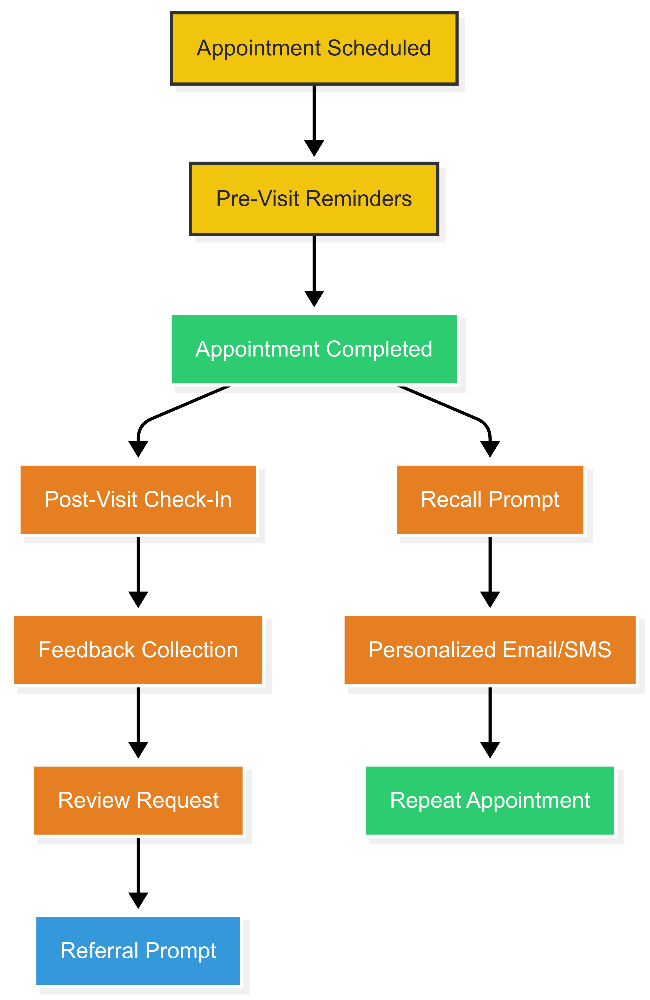

---

# 🦷 3.5 Patient Engagement & Retention  
## Turning First-Time Visitors into Lifelong Patients  

---

## 🎯 Objective

To build a **proactive, personalized patient engagement strategy** that strengthens loyalty, increases appointment adherence, and encourages referrals — turning **first-time visitors into lifelong patients**.

This strategy ensures that every patient interaction builds trust, improves satisfaction, and drives long-term growth.

---

## 🔍 The Challenge

Currently, there is **limited focus on structured post-visit engagement** or personalized follow-up. Without consistent communication:

- ❌ Patients forget about your clinic between visits  
- ❌ Missed appointments go unaddressed  
- ❌ Opportunities for referrals and loyalty are missed  

In healthcare, **retaining existing patients is more cost-effective than acquiring new ones** — yet many practices overlook this powerful growth lever.

---

## 💡 Why This Matters

A strong patient retention strategy not only improves **revenue predictability** — it also builds **trust**, enhances **reputation**, and supports **organic growth** through word-of-mouth.

By engaging patients at key moments in their journey — **before, during, and after appointments** — we create a cycle of care that keeps them coming back.

---

## 🌟 Strategic Actions

We’ll implement a **smart, automated patient engagement system** that delivers the right message, at the right time, to the right patient.

### 1. **Automated Patient Communication System**
Set up intelligent, automated messaging across key touchpoints:
- ✅ Appointment reminders (SMS + email)  
- ✅ Post-visit check-ins (“How was your experience?”)  
- ✅ Oral health tips tailored to treatment history  
- ✅ Recall prompts for hygiene visits  

These messages will be branded, professional, and personalized using patient data.

---

### 2. **Personalized Email & SMS Campaigns**
Use segmentation to deliver targeted content:
- 📅 Hygiene recall campaigns  
- 📌 Treatment plan follow-ups  
- 🌞 Seasonal oral health tips  
- 🎉 Birthday greetings or wellness check reminders  

This ensures patients feel **seen and valued** beyond just their appointment.

---

### 3. **Feedback Loop & Reputation Management**
After each visit:
- 📝 Send a short survey to gather feedback  
- ⭐ Encourage satisfied patients to leave reviews  
- 💬 Respond publicly to both positive and negative feedback  

This builds **credibility online** and shows patients you care.

---

### 4. **Patient Loyalty & Referral Program**
Launch a simple, incentive-based program:
- 🎁 Refer-a-friend bonuses  
- 🏅 Loyalty points for repeat visits  
- 💰 Exclusive dental tips or discounts for long-term patients  

This turns happy patients into **brand advocates**.

---

## ✅ Benefits

| Benefit | Explanation |
|--------|-------------|
| **Higher Retention Rates** | Engaged patients are more likely to return |
| **Improved Appointment Adherence** | Automated reminders reduce no-shows |
| **Increased Referrals** | Satisfied patients recommend your practice |
| **Stronger Patient Relationships** | Personalized communication builds trust |
| **Lower Acquisition Costs** | Retaining patients costs less than finding new ones |

---

## 🧠 Intelligent Patient Engagement Flow

Here’s how we’ll create a seamless, automated engagement experience:

This system ensures that every patient is **guided through a consistent, caring journey** — increasing satisfaction and retention at every stage.

---

## 🚀 Milestone: Launch Engagement System by Q4 2025

We aim to launch the full patient engagement system — including automation, email workflows, and feedback tools — by **Q4 2025**, with measurable improvements in:
- ✅ Patient retention rates  
- ✅ Review volume and quality  
- ✅ Recall appointment bookings  
- ✅ Referral traffic  

Quarterly reports will track progress and identify opportunities for improvement.

---

## 📊 Business Impact

| Metric | Goal |
|--------|------|
| Patient Retention Rate | Increase by 20% in 12 months |
| No-Show Rate | Reduce by 15% through reminders |
| Online Reviews | Increase by 30% with automated requests |
| Referral Traffic | Grow by 25% through loyalty program |
| Patient Satisfaction Score | Improve by 20% via post-visit surveys |

These metrics will be tracked in a **centralized dashboard** for transparency and continuous improvement.

---

## 💬 Final Thought for Your Client

> “Attracting new patients is important — but keeping them is how your business grows sustainably. With a smart patient engagement strategy, we’ll ensure every patient feels valued, informed, and connected to your team — creating lasting relationships that drive loyalty, satisfaction, and referrals.”

---

## 🧩 Ready to Build This System?

Let’s begin by:
- Mapping out your current patient journey  
- Identifying key communication touchpoints  
- Setting up automation tools and templates  
- Launching a pilot with one clinic location  

We’ll scale across all clinics in Q4 2025.

---

